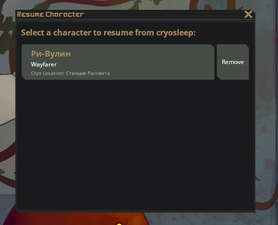
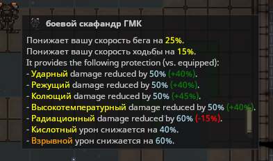
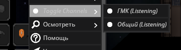
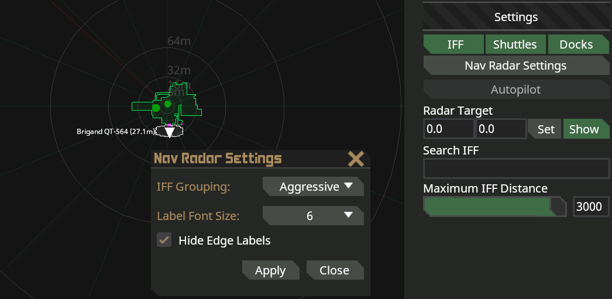
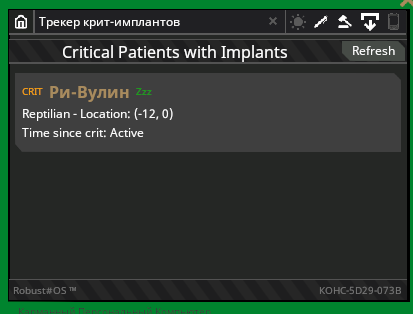
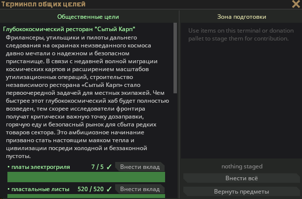
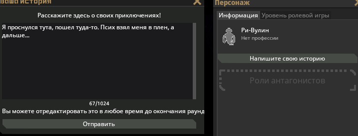
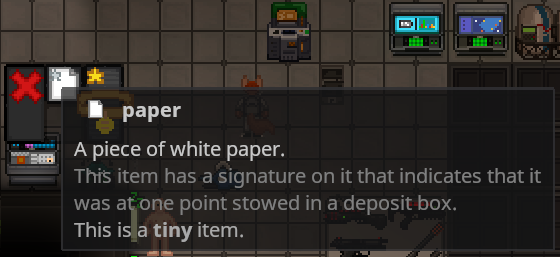
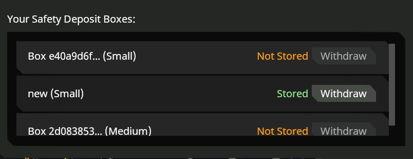

import CenterTitle from '../../components/CenterTitle.astro';
import MechanicCard from '../../components/MechanicCard.astro';
import CardGrid from '../../components/CardGrid.astro';

<CenterTitle />

    <CardGrid>
        <MechanicCard title="Автоматизированное событие перевозчика" tag="Events">
            Время от времени в сектор заходит автоматизированный грузовой корабль, перевозящий ценные грузы — тихий, хорошо защищенный и набитый таким количеством богатств, которого большинство станций не видят за месяц. Ни экипажа, ни сигнала бедствия, только заданный курс и грузовой отсек, за который стоит побороться.
        </MechanicCard>
    
        <MechanicCard title="Горячая смена персонажей в криокапсулах" tag="UX">
            Хотите временно переключиться на другого персонажа прямо посреди смены, чтобы вернуться к прежнему позже? С функцией сохранения персонажей через крио-смену это стало возможно!
    
            Теперь вы можете сделать перерыв в работе медотдела, чтобы ненадолго зайти за своего персонажа вне закона, а затем спокойно вернуться обратно на медицинскую должность. И всё это без потери вашего снаряжения, наночатов, предметов в инвентаре и одежды.
            
        </MechanicCard>
        
    </CardGrid>
    <CardGrid>
        <MechanicCard title="Изучите и сравните" tag="QOL">
            Теперь вы можете изучать и сравнивать характеристики оружия и бронекостюмов.
            
        </MechanicCard>
        <MechanicCard title="Глушение каналов гарнитуры" tag="UX">
            Надоел общий канал связи, но не хочется выковыривать отверткой ключи шифрования? Всё просто! Вы можете глушить отдельные частоты прямо в настройках своей гарнитуры.
            
        </MechanicCard>
    </CardGrid>
    <CardGrid>
        <MechanicCard title="Очистка консоли IFF" tag="QOL">
            Избавьтесь от визуального мусора на экране консоли IFF благодаря этому удобному улучшению интерфейса.
            
        </MechanicCard>
        <MechanicCard title="Медицинский критический КПК" tag="Gameplay">
            Приложение Medical Crit PDA предоставляет мгновенный список всех текущих критических ситуаций и случаев смерти, помогая медицинским бригадам координировать действия быстрее, даже если первоначальная связь была потеряна.
            
        </MechanicCard>
    </CardGrid>
    <CardGrid>
        <MechanicCard title="Система постоянных целей сообщества" tag="Gameplay">
            Объединяйтесь, чтобы сформировать будущее станции. Терминал «Общественные цели» — это новый элемент инфраструктуры станции, позволяющий всей команде объединиться вокруг общих целей, установленных администрацией станции. В каждом раунде администраторы могут определять цели, доставлять тонны сырья, собирать средства на исследования или накапливать необходимые запасы — а терминал отслеживает коллективный прогресс команды в режиме реального времени на протяжении всех смен.
            
        </MechanicCard>
        <MechanicCard title="Истории игроков для всех!" tag="UX">
            Изначально только пираты могли писать сюжетные линии, описывающие их смену. Однако, учитывая, что трёхдневная смена может иметь интересные последствия не только для пиратов, эта возможность была расширена, и теперь все игроки могут оставить свою историю.
            
        </MechanicCard>
    </CardGrid>
    <CardGrid>
        
        <MechanicCard title="Сейф предметов" tag="Gameplay">
            Сейфы обеспечивают ограниченное постоянное хранение между раундами, позволяя игрокам хранить важные личные вещи и развивать сюжетные линии персонажей, не превращая хранение в накопительство.
            
            
        </MechanicCard>
    </CardGrid>

