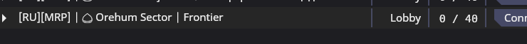

import { Card, CardGrid, LinkCard } from '@astrojs/starlight/components';
import CenterTitle from '../../components/CenterTitle.astro';

<CenterTitle />

:::caution[Сервер находится в разработке.]
Хотя наш сайт открыт для посещения, пожалуйста, имейте в виду, что мы все еще находимся в процессе разработки новых функций и улучшений.
:::

### Впервые на космической станции 14?

<Card title="Впервые в Space Station 14?">
  1. **Скачайте Space Station 14** 
  Скачайте лаунчер Space Station 14 с официального сайта: [spacestation14.io](https://spacestation14.com/)

  2. **Установите лаунчер**
  Запустите установщик и следуйте инструкциям по установке. 
  Лаунчер автоматически загрузит все необходимые файлы игры.

  3. **Найдите нас в списке серверов** 
  Откройте лаунчер и перейдите в Список серверов. 
  Введите в поиске "Fractal Sector" и найдите в результатах `💠 Fractal Sector — Frontier [RU][MRP]`. 
  Нажмите Подключиться, чтобы войти.
  
  
  4. **Присоединяйтесь к приключению**
  Создайте своего персонажа, ознакомьтесь с правилами и начните свое путешествие по Фронтиру. 
  Не забывайте уважать других игроков и получать удовольствие от игры!
</Card>

<LinkCard 
    title="Краткое руководство пользователя" 
    href="/wiki/quick-start/"
    description="Готовы начать? Наше руководство по быстрому старту расскажет обо всем, что необходимо знать перед вашим первым раундом."
/>
<LinkCard 
    title="Присоединяйтесь к нашему Discord" 
    href="https://discord.gg/ZC94VrbFNY"
    description="Следите за ходом разработки, знакомьтесь с сообществом и получайте уведомления о запуске сервера."
/>

